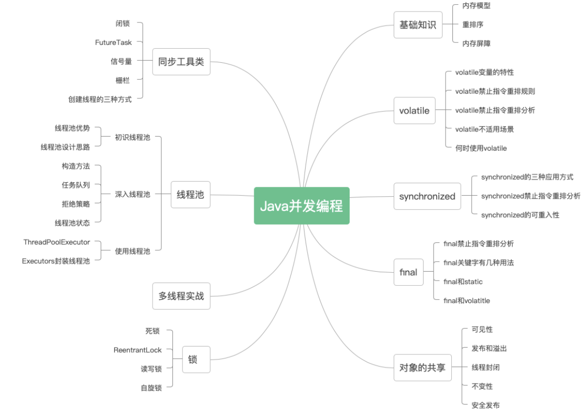

# 多线程 部分 学习 与 整理

## Java 并发编程

###  第一章 基础
    1.原子性
    2.可见性
    3.有序性
    4.Java 内存模型 JMM

### 第二章 volatile
    禁止指令重排序
    保证 可见性 和 有序性
    
### 第三章 synchronized
        
### 第四章 final

### 第五章 对象的共享
    
### 第六章 同步工具类
    CountDownLatch
    FutureTask
    Semaphore
    CyclicBarrier
    创建线程的方式：
    
### 第七章 线程池基本知识
    
### 第八章 多线程实战
    使用线程池 解决什么问题
### 第九章 锁
    1.死锁
    2.ReerantLock
    3.内置Synchronized
    4.其它锁
    
