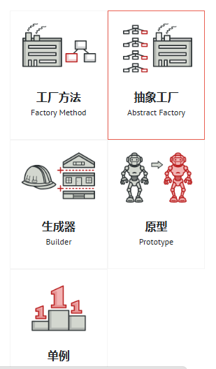
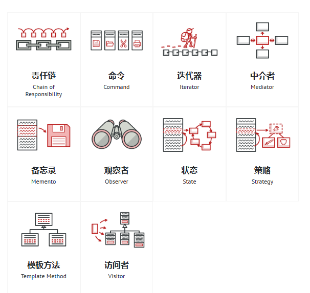

# 设计模式的理解 Design Patterns 
参考资料 ：https://refactoringguru.cn/design-patterns/catalog
    是什么？优势？分类？历史？争议？
    保持 追问本质,和 联系实际 的学习习惯.采用 场景化建模 + 对比反思 + 源码印证 三位一体 学习方法.
    从 类 和对象的 角度去理解
    单线程 多线程 
    总目标: 高内聚 低耦合
        创建型模式: 怎么创建对象
        结构型模式: 类与对象怎么组合
        行为型模式: 对象之间怎么通信
    具体:SOLID (是什么 (如何理解) - 应用场景)
        开闭 原则: 对扩展开放，对修改关闭
        里氏替换 原则: 实现抽象化  
        依赖倒转 原则: 任何基类可以出现的地方，子类一定可以出现
        接口隔离 原则 : 依赖于抽象而不依赖于具体
        最少知道 原则: 实体应当尽量少地与其他实体之间发生相互作用
        合成复用 原则: 尽量使用合成/聚合的方式，而不是使用继承

    设计模式之间的关系：

   
# 具体设计模式

    1.创建型模式

    2.结构型模式

    3.行为型模式

    上面 可能 不全面 ，但是基本包含了 常用的 23种设计模式。
##  如何判断 自己是否 掌握了 设计模式?
    
    1.它的标准结构图（UML）长什么样？
    
    2.在什么具体的业务场景下，必须用它？（痛点）

    3.它和长得像的其他模式（如 Strategy vs State）有什么本质区别？

    4.用了它，我牺牲了什么（复杂度、性能、内存）？

## 